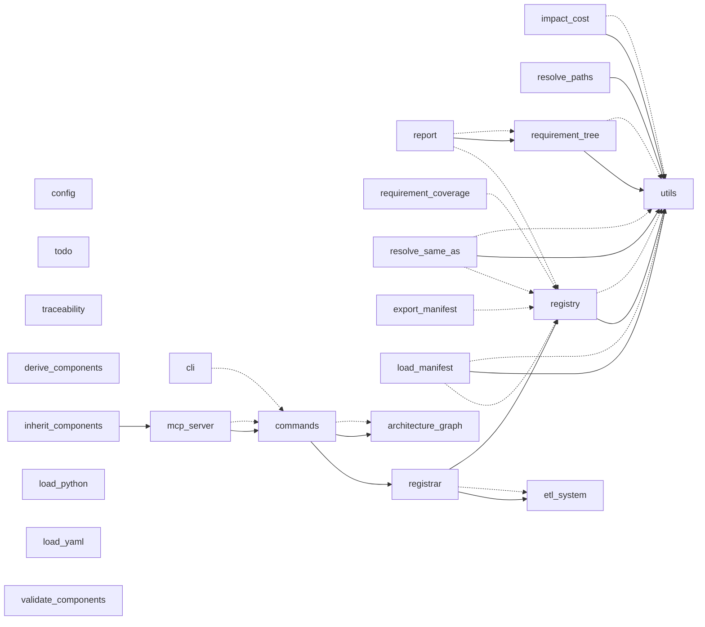

# Architecture

File-level call/import structure of iacs's own codebase, parsed from source the same way `iacs.dataflows.etl.load_python` parses any project's code -- solid arrows are function/method calls, dashed arrows are imports. Only entities with a docstring or `__iacs__` metadata become graph-relevant (see that module's own docstring for why undocumented helpers are deliberately excluded); a file with none of its own still shows up if something documented elsewhere calls into it.

Regenerate with: `uv run python docs/gen_architecture_diagrams.py`

