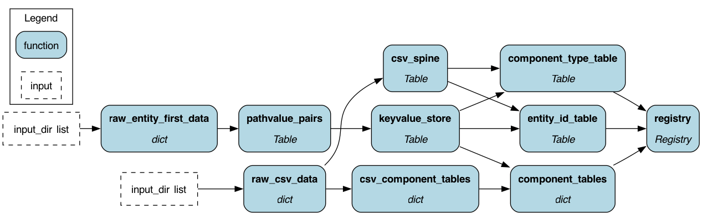
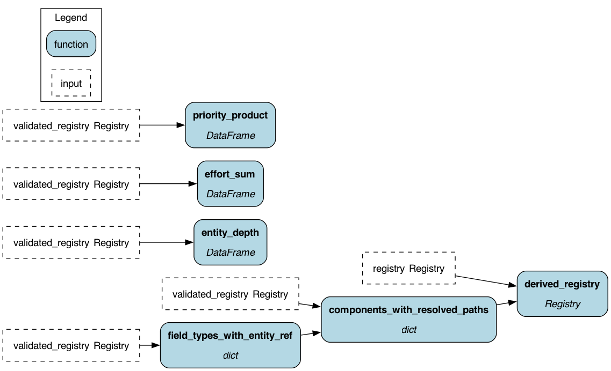
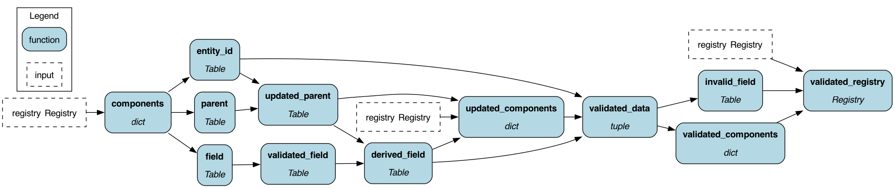
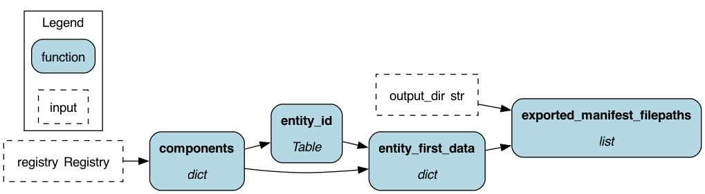

# Dataflow DAGs

Hamilton DAG visualizations for all iacs dataflows.
Regenerate images with: `uv run python docs/gen_dag_images.py`

---

## load_manifest

Converts entity-centered YAML data into the component-centered Registry format.

---

## derive_components

Derives additional components from the base input (e.g. resolving entity references).

---

## validate_registry

Validates the registry against schemas and constraints.

---

## export_manifest

Exports the registry back to entity-centered YAML format.

---

## base_etl

Base ETL utilities shared across dataflows.

---

## Audits

### requirement_coverage

Checks that all requirements have at least one solution.

---

### traceability

Checks that all solutions can be traced back to a requirement.

---

### todo

Checks for unresolved TODO items in the solution.

