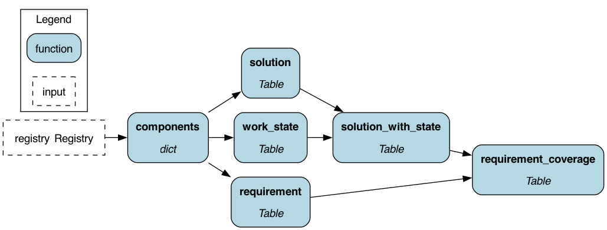
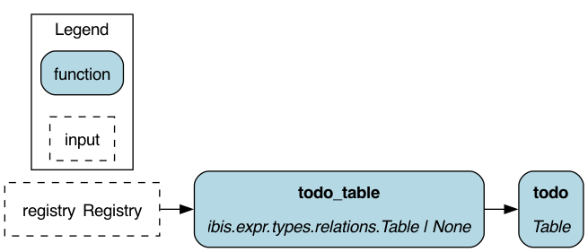
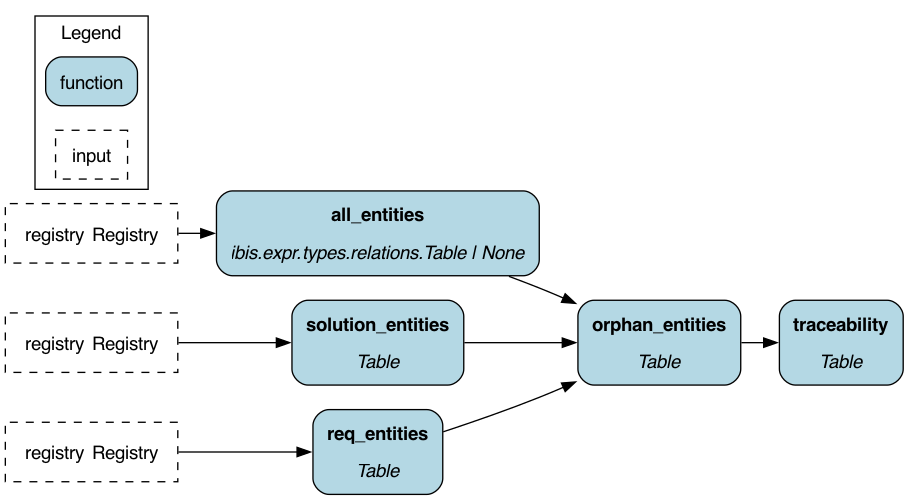
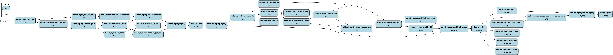

# Dataflow DAGs

Hamilton DAG visualizations for iacs dataflows, grouped by the
subpackage each module lives in under `iacs/dataflows/`.
Regenerate with: `uv run python docs/gen_dag_images.py`

## `audit/`

### `audit.requirement_coverage`

### `audit.todo`

### `audit.traceability`

---

## `derive/`

### `derive.derive_components`

### `derive.impact_cost`

### `derive.inherit_components`

### `derive.resolve_paths`

---

## `etl/`

### `etl.export_manifest`

### `etl.load_manifest`

### `etl.load_python`

### `etl.load_yaml`

---

## `validation/`

### `validation.validate_components`

---

## Top-level

### `base_etl`

